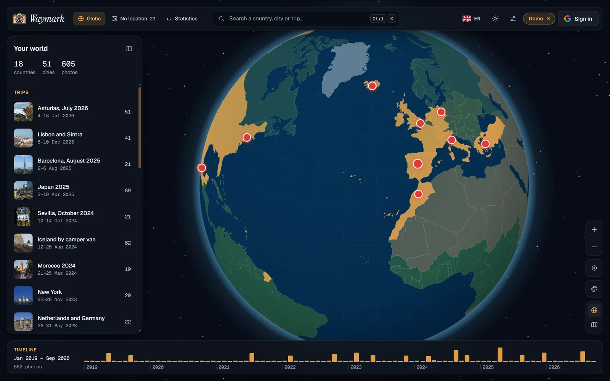
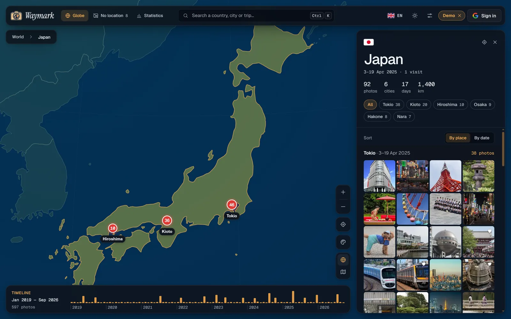
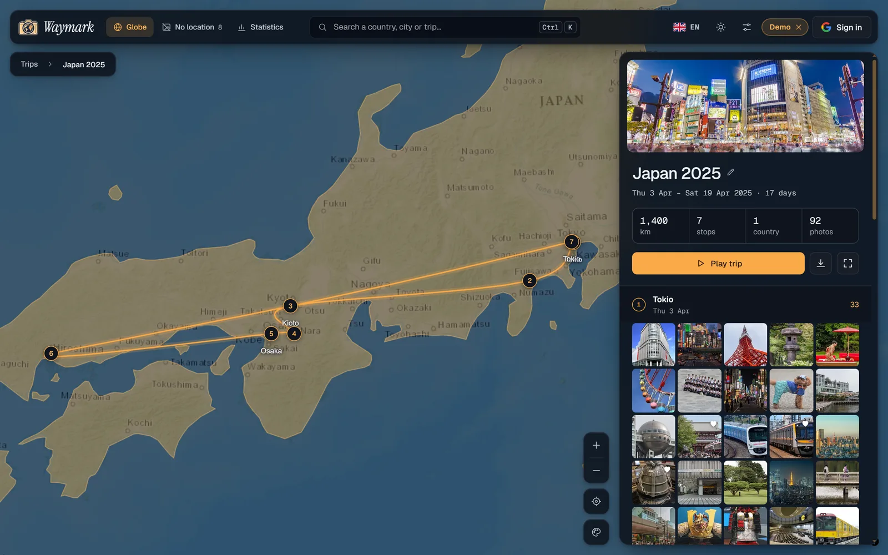
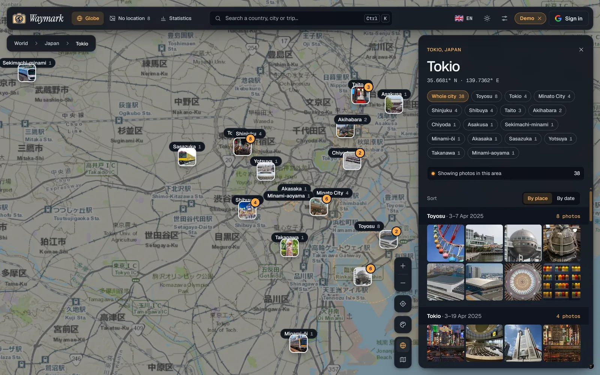
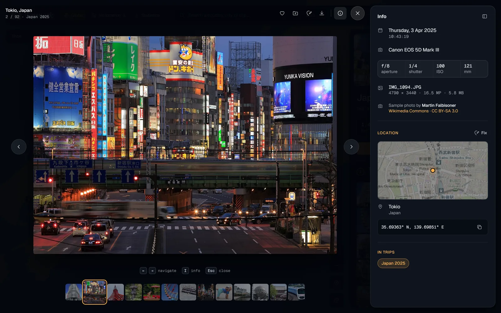
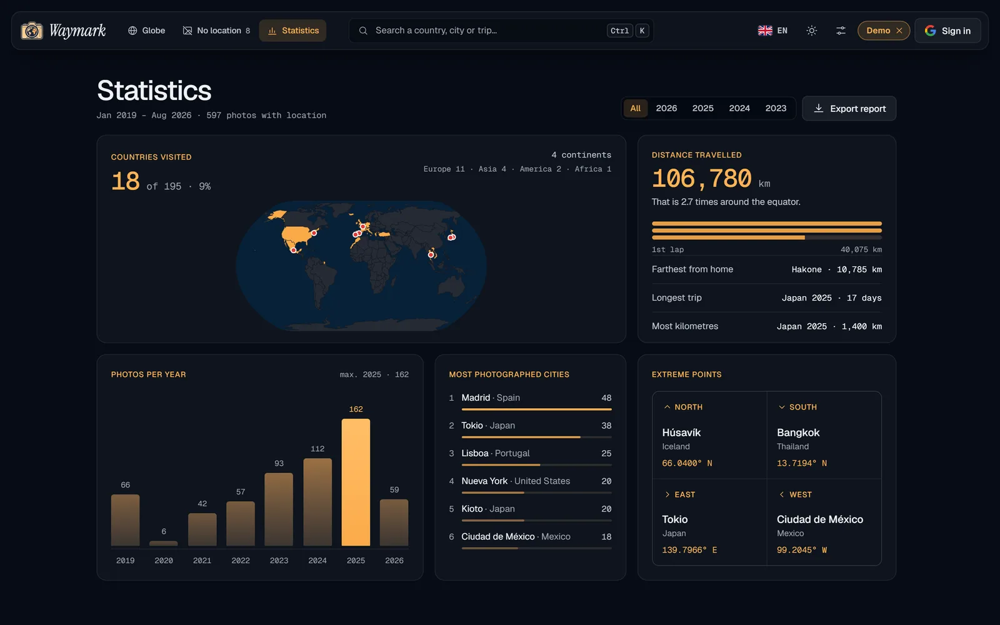
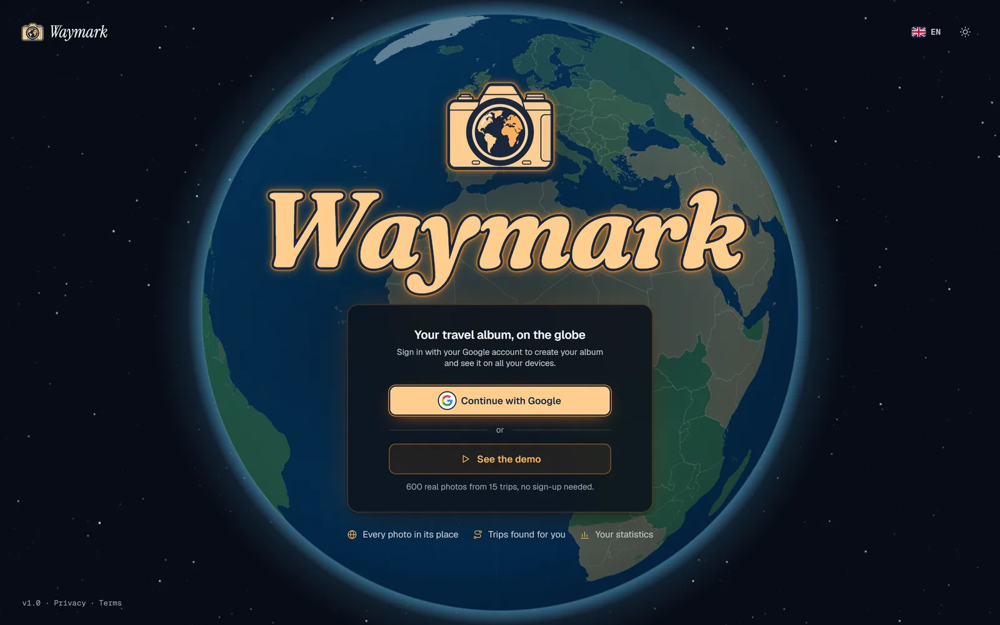
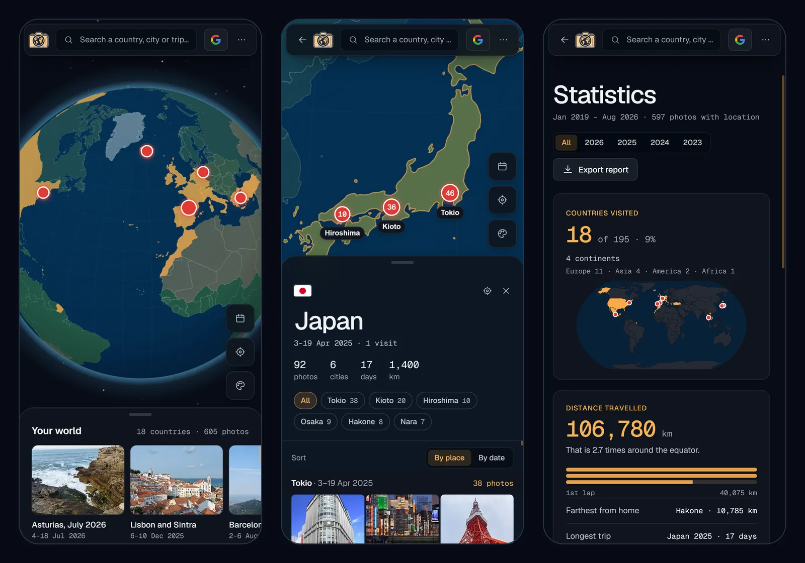

<div align="center">

<picture>
  <source media="(prefers-color-scheme: dark)" srcset="docs/readme/logo-dark.png">
  
</picture>

# Waymark

**Your trip around the world, one photo at a time.**<br>
Your travel photos placed on an interactive 3D globe, with no server and your own Google Drive as storage.

[**Open the app**](https://waymark.aleixaj.com) · [**Try the demo**](https://waymark.aleixaj.com/?demo) · [Español](README.md)


<p>
  <a href="README.md"></a>
  
</p>

</div>

<p align="center">
  
</p>

## What it is

Drop your photos in and Waymark reads where each one was taken to place it on the planet. Spin the globe, click a circle to see the photos of that area, fly into a country or a city, replay a trip along its route and check your statistics. Like Google Photos, but with a world map instead of albums.

A portfolio project built like a real product. **There is no server of its own:** photos are processed in the browser, the app works offline after the first visit and your album is stored in your own Google Drive, so it looks the same on all your devices.

**Try it without signing up:** click [_See the demo_](https://waymark.aleixaj.com/?demo). It loads about 600 real photos from [Wikimedia Commons](https://commons.wikimedia.org/), with their real location and camera, across 15 trips in 18 countries, like the album of a real person.

The interface is available in English, Spanish and Catalan.

## Screenshots

<table>
  <tr>
    <td width="50%"><br><sub><b>Country</b> · cities, days, kilometres and photos sorted by place</sub></td>
    <td width="50%"><br><sub><b>Trip</b> · the route is drawn stop by stop, with its photos</sub></td>
  </tr>
  <tr>
    <td width="50%"><br><sub><b>City</b> · street-level thumbnails and neighbourhoods to filter by</sub></td>
    <td width="50%"><br><sub><b>Viewer</b> · EXIF, location map and credits for every photo</sub></td>
  </tr>
  <tr>
    <td width="50%"><br><sub><b>Statistics</b> · countries, distance, photos per year and extreme points</sub></td>
    <td width="50%"><br><sub><b>Welcome</b> · sign in with Google or open the demo without an account</sub></td>
  </tr>
</table>

<p align="center"><br><sub><b>Mobile</b> · panels become bottom sheets and the ⋯ menu includes the language</sub></p>

## Highlights

- **Smooth 3D globe** with MapLibre GL in globe projection, styled from the app's design tokens, with a custom halo and shading moved by the GPU.
- **Parallel import** with a pool of Web Workers: SHA-256 fingerprint to skip duplicates, EXIF reading and thumbnails without blocking the UI. Supports JPG, HEIC and **RAW** (it extracts the JPEG preview the camera stores inside).
- **Three photo sources:** the device, **Google Drive** (without duplicating files) and **Google Photos** through Google Takeout, choosing albums.
- **Fully offline places:** 241 countries and 34,146 cities bundled as static data; the country and city of each photo are computed in the browser.
- **Trips detected automatically** from dates and places, with an animated route, stages and GPX export.
- **Estimated locations** for photos without GPS (WhatsApp, cameras with location off) from photos taken around the same time or in the same album.
- **Google Drive sync** without a backend: Google sign-in in the browser, light copies in a folder of the user's Drive and change merging across devices.
- **Three languages:** English, Spanish and Catalan, with a flag picker; dates, numbers, countries and trip titles switch instantly.
- **Purposeful animation:** the logo's camera fires a flash on the way in, the theme is revealed in a circle, each trip's route draws itself and photos slide in the viewer.
- **Accessible:** WCAG AA contrast checked with axe, full keyboard navigation, screen reader labels, high contrast mode and support for _reduced motion_.
- **Quality:** strict TypeScript, 66 unit tests of the core logic, ESLint, Prettier and `svelte-check` with no errors.

## Features

- **Globe view** with photo clusters, visited countries highlighted and a timeline to filter by date.
- **Zone panel:** clicking a circle on the map frames its photos and lists them grouped by city; each smaller circle narrows the selection down to the street.
- **Country view** with cities, days and distance travelled; photos sorted by place or by date.
- **City view** at street level: thumbnails on the map, a list synced with what you see and **neighbourhoods** drawn on the map (Shinjuku inside Tokyo, Kópavogur inside Reykjavík) to filter by area.
- **Automatic trips** with route, stages, a _"Play trip"_ camera flight, editable title and cover, and GPX export.
- **Photo viewer** with EXIF data (camera, lens, settings), location map, favorites and location fixing.
- **Photos without a location:** grouped by album, date or camera; drag them onto the globe or place a whole album with a place search.
- **Statistics:** countries, continents, distance travelled, photos per year, top cities and extreme points.
- **Search** (Ctrl/⌘ K) for countries, cities, trips or pasted coordinates.
- **Globe color styles:** natural, grey (the world in grey and your countries in color), night and atlas, with a preview and saved choice.
- **Languages:** English, Spanish and Catalan, chosen with flags in the top bar or in settings (the first time it follows the browser language).
- **Settings:** dark/light/system theme, km/mi, map style, reduced motion, globe quality, storage and export.
- **Responsive and installable:** on phones the panels become draggable bottom sheets, and the app can be added to the home screen.

## Tech stack

| Layer      | Choice                                    | Why                                                                                                                          |
| ---------- | ----------------------------------------- | ---------------------------------------------------------------------------------------------------------------------------- |
| Framework  | SvelteKit 2 + Svelte 5 (runes)            | Fine-grained reactivity without a virtual DOM: with thousands of photos only what changes updates. Built as a static SPA.    |
| Language   | TypeScript 6 (`strict`)                   | Data models shared between workers, database and views.                                                                      |
| Build      | Vite 8                                    | Workers as modules, code splitting per route and lazy loading of heavy libraries.                                            |
| Map        | MapLibre GL 6                             | Open source WebGL 3D globe, no keys or usage limits.                                                                         |
| Clustering | Supercluster                              | Clusters thousands of points per zoom level in milliseconds.                                                                 |
| Geometry   | d3-geo                                    | Point in country, bounds and the flat map in Statistics.                                                                     |
| Metadata   | exifr                                     | Fast EXIF and GPS reading, also for TIFF-based RAW formats.                                                                  |
| Storage    | Dexie (IndexedDB)                         | Stores photos, thumbnails and data in the browser, with indexes and migrations.                                              |
| Takeout    | zip.js                                    | Reads multi-GB zips without unzipping them: each photo is opened only when its turn comes.                                   |
| Account    | Google Identity Services + Drive REST API | Sign-in and sync without a server of our own, with the minimal `drive.file` permission.                                      |
| Languages  | Own translator (no library)               | Small dictionaries per screen, with plurals and placeholders; TypeScript checks that the three languages have the same keys. |
| Quality    | Vitest, ESLint, Prettier, svelte-check    | Tests of the domain logic and type checking of components.                                                                   |
| Deployment | Cloudflare Workers (static assets)        | Static site on the edge network, with its own cache headers and SPA routes resolved by Cloudflare.                           |
| Scripts    | Node + sharp                              | Build the geo data, the sample library and every size of the logo.                                                           |

## Architecture

The app is a static SPA. All the heavy work happens in the browser, split so the globe never stutters:

```txt
Files (device, Drive or a Takeout zip)
      |
importer.ts ── spreads the photos across Web Workers (max. 4)
      |           SHA-256 fingerprint · EXIF / RAW · WebP thumbnail
      |
main thread ── country, city and neighbourhood (offline data) · saved in batches
      |
IndexedDB (Dexie) ── original photos, thumbnails and data
      |
library.svelte.ts ── light points (id, position, date) + derived state:
      |                trips, statistics, timeline, estimates
      |
Views (globe, country, city, trip) · MapLibre + Supercluster
      |
sync ── your Google Drive: light copies + library.json
```

- **The map only receives light data.** Images load when a thumbnail gets close to the screen and are kept in a memory-bounded cache.
- **The domain logic is pure and tested:** trip detection, location estimates, Takeout matching, the sync plan, the city index and the globe math live in TypeScript modules with no UI dependencies.

## Technical decisions

**Import.** Each file goes through a worker that fingerprints it (SHA-256 of its size, start and end, to skip duplicates even when renamed), reads the EXIF and makes the thumbnail with `createImageBitmap`, which resizes while decoding. A stuck file gets its worker replaced. Formats the browser can't show (HEIC in Chrome) keep their GPS and date with a placeholder preview.

**RAW.** The worker looks for the JPEG preview the camera stored inside the file, walking the JPEG markers to find where it ends and skipping the lossless-JPEG sensor data browsers can't read. The preview is turned upright with the EXIF orientation. Metadata comes from exifr, from the CMT boxes of Canon CR3 files or from the preview itself (Fujifilm).

**Google Takeout.** The Google Photos API doesn't give other apps the location of your photos; Takeout does keep it, in a JSON file next to each photo. Waymark reads the zips without unzipping them, pairs each photo with its JSON (Takeout names them in several ways, all covered by tests) and lets you choose the albums.

**Offline places.** Country shapes (Natural Earth) and cities over 15,000 people (GeoNames) ship as static files. A 1° grid index finds the closest place in microseconds. When that place lies inside the urban area of a much bigger city (its reach grows with population), it becomes a neighbourhood of that city.

**Trips.** Home is the place photographed in the most different months. Photos away from home are grouped into trips that end when you get back or after a pause of more than 2.5 days; consecutive photos in the same city form a stage. Edited titles and covers are anchored to a photo, so they survive when the trip changes.

**Estimated locations.** A photo without GPS takes the place of the closest photo with GPS in time (up to 2 hours) or, if there is none, of the closest one in the same album. It is marked as estimated and can be fixed.

**Sync.** Sign-in uses Google Identity Services in the browser with the `drive.file` permission: Waymark only sees the files it creates or the ones the user picks. Drive keeps a copy of each photo at 2048 px (about 20 times lighter than the original) and a `library.json` with the data. Each device uploads what is new and downloads what the others added; when a photo changed in two places, the most recent change wins. Photos picked from Drive are not copied: Waymark keeps a link to the file.

**Sample library.** A script (`scripts/build-demo.mjs`) searches Wikimedia Commons for freely licensed photos near every stop of the sample trips, prefers the ones Commons marks as quality images and drops maps, portraits and automatic street captures. The 605 thumbnails are packed as WebP in a single 6 MB file served by the site itself: the demo loads with one download and a progress window, and the globe fills up at once at the end. The big image is requested from Commons when a photo is opened. Every photo shows its author and license in the viewer.

**Account and privacy.** The album belongs to a Google account: without signing in you can only open the demo. Signing out runs a last sync, warns if any photo is not uploaded yet and makes the browser forget the album. No server and no analytics; photos only leave the browser to the user's own Drive folder. The [privacy policy](https://waymark.aleixaj.com/privacidad) has the details.

**Languages.** Each screen has its own dictionary, Spanish as the source with English and Catalan next to it; a missing key does not compile. Dates and numbers come from `Intl` plus a small month table, country names from `Intl.DisplayNames`, and the place search asks for results in the chosen language. Language and theme changes use the View Transitions API.

**Accessibility.** Keyboard order follows the screen (top bar, panel, map), map markers tell screen readers their place and panels are almost opaque so text stays readable over any part of the map. Every screen passes axe with no errors in light and dark themes, with styles for `prefers-contrast` and Windows forced colors.

## Performance

Measured in Chrome with the CPU slowed down 4 times, using a library of ~2,000 photos:

- **Globe halo and shading** moved with `transform`: the GPU moves them, with no gradient repaint on every frame.
- **Street map** only downloaded and drawn when visible: dragging in the country view goes from ~50 to ~60 fps.
- **Markers:** clusters are only recomputed on a new zoom level or after moving away from the computed area, and the map size is only measured on resize.
- **Long lists** (a 300-photo trip) are rendered in steps while the browser is idle: the main-thread block when opening a trip drops from 480 to 235 ms.
- **Lazy loading:** the zip reader (128 KB) is only downloaded when a Takeout arrives, and the EXIF reader only lives in the workers.
- **Offline:** a service worker keeps the app shell and the geo data; IndexedDB is marked as persistent storage.
- **Reliable framing on the globe:** MapLibre's fitting zoom can be too close in globe projection; the camera is tried without drawing and corrected before flying.
- **Cheap animations:** panel entrances, counters and bars use only `opacity` and `transform`, and turn off with _reduced motion_.

## Project structure

```txt
src/
├── lib/
│   ├── map/          # Globe: style, markers, route, neighbourhoods, halo and camera
│   ├── photos/       # Import: workers, EXIF, RAW, Takeout, thumbnails, IndexedDB
│   ├── geo/          # Countries, cities, distances and place search
│   ├── library/      # Trips, estimates, statistics, timeline and formatting
│   ├── sync/         # Sync plan and light copy for Google Drive
│   ├── google/       # Google sign-in, Drive API and Drive picker
│   ├── i18n/         # Translator and dictionaries in Spanish, English and Catalan
│   ├── state/        # App state: library, settings, UI and import
│   ├── components/   # Panels, zone panel, viewer, search, settings, import...
│   └── demo/         # Sample library generator
├── routes/           # Globe, country, city, trip, "sin ubicación" and statistics
└── service-worker.ts # Offline support
scripts/              # Geo data, sample library and logo sizes
static/               # Countries and cities, demo thumbnails, icons and legal pages
wrangler.jsonc        # Cloudflare Workers deployment
```

## Getting started

```bash
pnpm install
pnpm dev
```

The app runs at `http://localhost:5173`. It works with no configuration: without Google keys you import directly. With the keys set, creating your album requires signing in with Google (or you can open the demo).

| Command                        | What it does                                                                 |
| ------------------------------ | ---------------------------------------------------------------------------- |
| `pnpm dev`                     | Development server                                                           |
| `pnpm build`                   | Builds the static site into `build/`                                         |
| `pnpm test`                    | Unit tests (Vitest)                                                          |
| `pnpm check`                   | Type check (`svelte-check`)                                                  |
| `pnpm lint`                    | Prettier + ESLint                                                            |
| `node scripts/build-demo.mjs`  | Rebuilds the sample library photos from Wikimedia Commons                    |
| `node scripts/build-geo.mjs`   | Rebuilds `static/geo` (needs `scripts/.cache/cities15000.txt` from GeoNames) |
| `node scripts/build-icons.mjs` | Builds the favicon, app icons and logo from `docs/brand/logo.png`            |

### Google sign-in

1. In [Google Cloud Console](https://console.cloud.google.com/), create a project and enable the **Google Drive API** and the **Google Picker API**.
2. In _Google Auth Platform_, set up the consent screen (External), add test users and the `drive.file` scope.
3. Create an **OAuth client ID** of type _Web application_ with your origins (`http://localhost:5173` and your production URL). To publish the app, link the `/privacidad` and `/terminos` pages on the consent screen.
4. To import from Drive, create an **API key** restricted to the Picker API and your origins, and copy the **project number**.
5. Copy `.env.example` to `.env` and fill in `VITE_GOOGLE_CLIENT_ID`, `VITE_GOOGLE_API_KEY` and `VITE_GOOGLE_APP_ID`.

### Deployment

The site is published on Cloudflare Workers as static assets (`wrangler.jsonc`): every `push` to `main` builds with `pnpm run build` and deploys with `npx wrangler deploy`. The three `VITE_GOOGLE_*` variables go in the project's build variables, because they are bundled into the site at build time.

## Roadmap

- [x] 3D globe, country, city and trip views, viewer, statistics and search.
- [x] Worker-based import with duplicates, HEIC and RAW.
- [x] Offline places with neighbourhoods and main cities.
- [x] Automatic trips with route, stages and GPX.
- [x] Offline support with a service worker.
- [x] Google account, Drive sync and import from Drive and Google Takeout.
- [x] Estimated locations and placing whole albums with a place search.
- [x] Performance review measured with Chrome profiles.
- [x] Selectable globe color styles (natural, grey, night and atlas).
- [x] Zone panel when clicking the map and photos sorted by place.
- [x] Accessibility review (WCAG AA) and interface animations.
- [x] Logo, installable icons and deployment on Cloudflare Workers with a custom domain.
- [ ] Continuous integration with GitHub Actions (tests and types on every `push`).
- [x] Interface in English, Spanish and Catalan.
- [x] App screenshots in this README.
- [ ] Short demo video.

## Why this project matters

- **A complete product without a backend:** import, storage, sync and offline support solved on the client, with clear privacy decisions.
- **Real data problems:** photos without GPS, RAW formats, Google exports with inconsistent file names, EXIF time zones, duplicates and neighbourhoods that are not cities.
- **Performance with judgment:** every optimization starts from a measurement, and the ones that didn't help were dropped.
- **Attention to detail:** checked accessibility, animations that respect the user and an experience designed for phones too.
- **Maintainable code:** domain logic in pure, tested modules, separate from the UI and the map.

## Data and credits

- Countries: [Natural Earth](https://www.naturalearthdata.com/) via [world-atlas](https://github.com/topojson/world-atlas) (public domain)
- Cities: [GeoNames](https://www.geonames.org/) `cities15000` (CC BY 4.0)
- Street and satellite maps: Esri World Topo Map and World Imagery
- Sample photos: [Wikimedia Commons](https://commons.wikimedia.org/), each with its author and free license (CC0, public domain, CC BY or CC BY-SA), listed in [`docs/demo-credits.md`](docs/demo-credits.md)
- Place search: [Nominatim](https://nominatim.org/) (© OpenStreetMap contributors)
- Flags: [country-flag-icons](https://gitlab.com/catamphetamine/country-flag-icons)
- Fonts: Geist, Geist Mono, Instrument Serif and Fraunces

---

Portfolio project by [Aleix Auqué](https://github.com/AleixAj).
