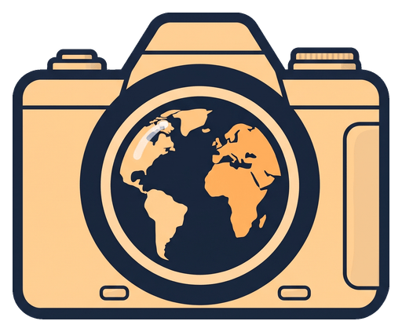
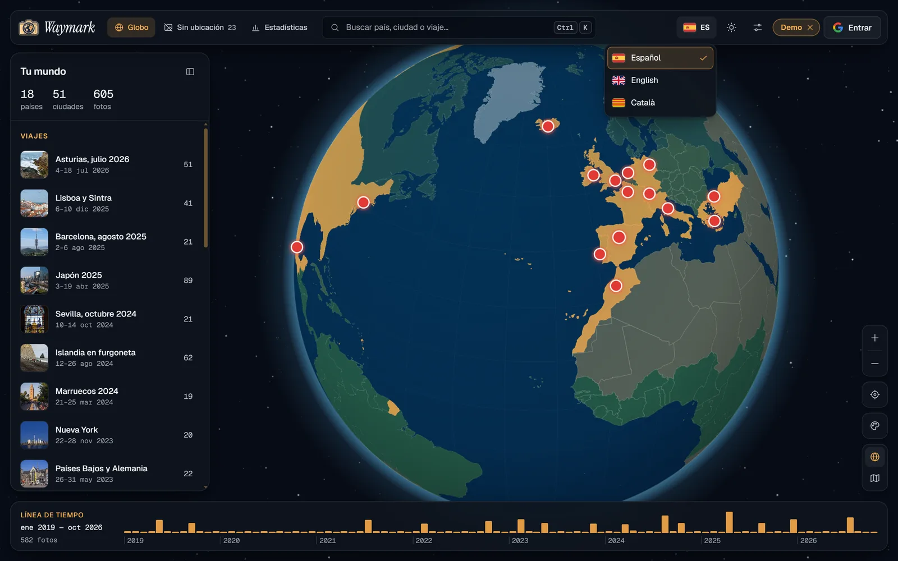
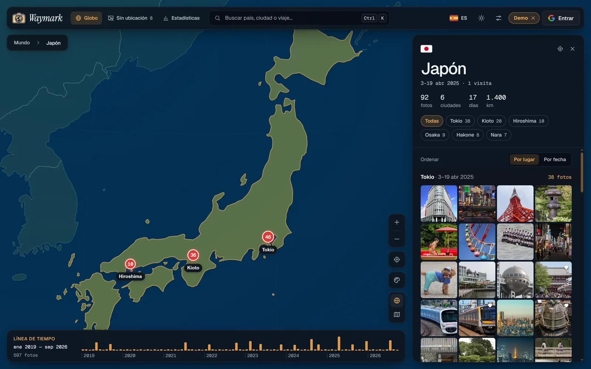
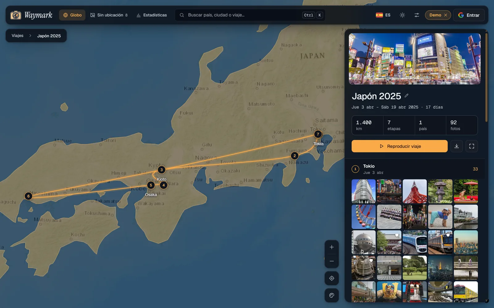
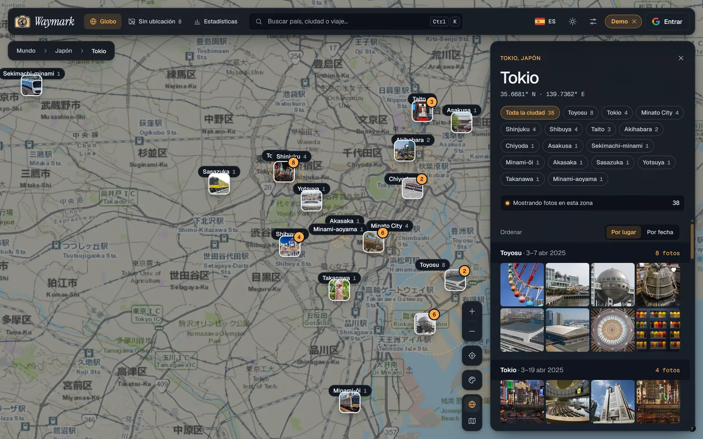
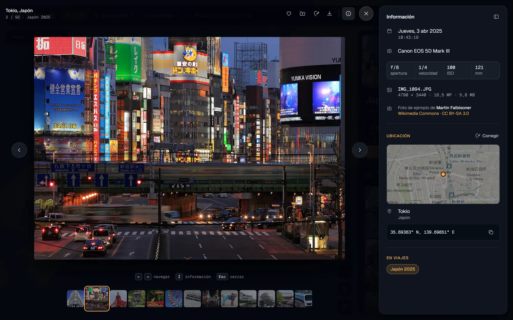
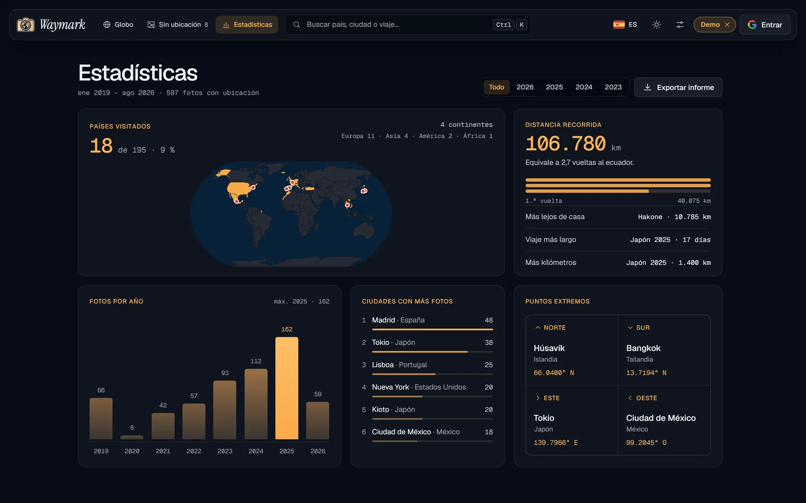
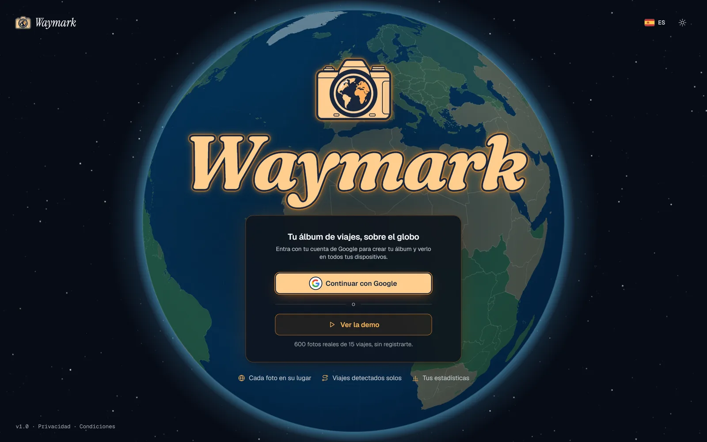
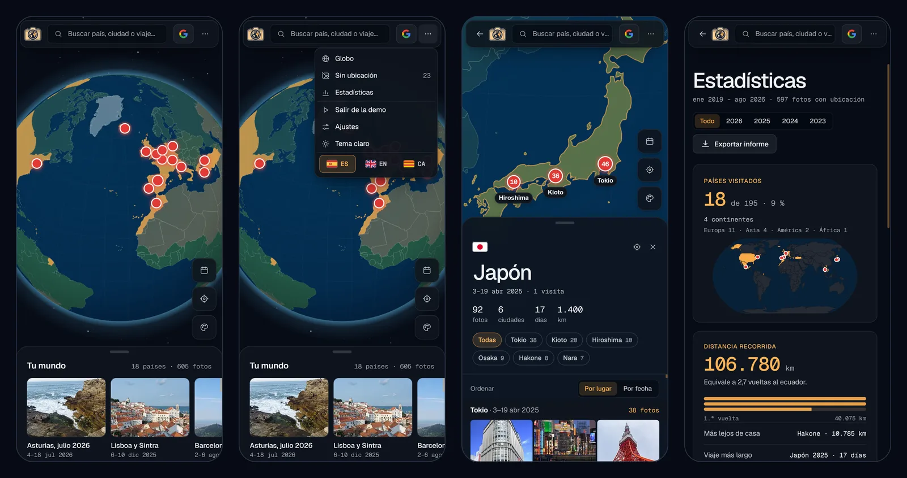

<div align="center">

<picture>
  <source media="(prefers-color-scheme: dark)" srcset="docs/readme/logo-dark.png">
  
</picture>

# Waymark

**Tu vuelta al mundo, foto a foto.**<br>
Tus fotos de viaje colocadas sobre un globo terráqueo en 3D, sin servidor y con tu propio Google Drive como almacenamiento.

[**Abrir la app**](https://waymark.aleixaj.com) · [**Ver la demo**](https://waymark.aleixaj.com/?demo) · [English](README.en.md)


<p>
  
  <a href="README.en.md"></a>
</p>

</div>

<p align="center">
  
</p>

## Qué es

Arrastras tus fotos y Waymark lee dónde se hizo cada una para colocarla en el planeta. Giras el globo, pulsas un círculo para ver las fotos de esa zona, entras en un país o una ciudad, revives un viaje siguiendo su ruta y consultas tus estadísticas. Como Google Fotos, pero con el mapa del mundo en lugar de álbumes.

Es un proyecto de portfolio con enfoque de producto real. **No tiene servidor propio:** las fotos se procesan en el navegador, la app funciona sin conexión después de la primera visita y tu álbum se guarda en tu propio Google Drive, así que lo ves igual en todos tus dispositivos.

**Pruébalo sin registrarte:** pulsa [_Ver la demo_](https://waymark.aleixaj.com/?demo). Carga unas 600 fotos reales de [Wikimedia Commons](https://commons.wikimedia.org/), con su ubicación y su cámara auténticas, repartidas en 15 viajes por 18 países, como el álbum de una persona de verdad.

## Capturas

<table>
  <tr>
    <td width="50%"><br><sub><b>País</b> · ciudades, días, kilómetros y fotos ordenadas por lugar</sub></td>
    <td width="50%"><br><sub><b>Viaje</b> · la ruta se dibuja parada a parada, con sus fotos</sub></td>
  </tr>
  <tr>
    <td width="50%"><br><sub><b>Ciudad</b> · miniaturas a nivel de calle y barrios para filtrar</sub></td>
    <td width="50%"><br><sub><b>Visor</b> · EXIF, mapa de la ubicación y créditos de cada foto</sub></td>
  </tr>
  <tr>
    <td width="50%"><br><sub><b>Estadísticas</b> · países, distancia, fotos por año y puntos extremos</sub></td>
    <td width="50%"><br><sub><b>Bienvenida</b> · entrar con Google o ver la demo sin registrarse</sub></td>
  </tr>
</table>

<p align="center"><br><sub><b>Móvil</b> · los paneles pasan a ser hojas inferiores que se arrastran</sub></p>

## Lo más destacado

- **Globo 3D fluido** con MapLibre GL en proyección de globo, estilizado desde los tokens de diseño de la app, con halo y sombreado propios que se mueven por GPU.
- **Importación en paralelo** con un grupo de Web Workers: huella SHA-256 para detectar duplicados, lectura de EXIF y miniaturas sin bloquear la interfaz. Soporta JPG, HEIC y **RAW** (extrae la vista previa JPEG que guarda la cámara).
- **Tres orígenes de fotos:** el dispositivo, **Google Drive** (sin duplicar archivos) y **Google Fotos** a través de Google Takeout, eligiendo álbumes.
- **Todo sin conexión:** 241 países y 34.146 ciudades empaquetados como datos estáticos; el país y la ciudad de cada foto se calculan en el propio navegador.
- **Viajes detectados solos** a partir de fechas y lugares, con ruta animada, etapas y exportación a GPX.
- **Ubicaciones estimadas** para fotos sin GPS (WhatsApp, cámaras sin ubicación) a partir de las fotos cercanas en el tiempo o del mismo álbum.
- **Sincronización con Google Drive** sin backend: login con Google en el navegador, copias ligeras en una carpeta del usuario y fusión de cambios entre dispositivos.
- **En tres idiomas:** español, inglés y catalán, con selector de banderas; fechas, números, países y títulos de viaje cambian al momento.
- **Animaciones con intención:** la cámara del logo dispara un flash al entrar, el tema se revela en círculo, la ruta de cada viaje se dibuja y las fotos se deslizan en el visor.
- **Accesible:** contraste WCAG AA comprobado con axe, navegación completa con teclado, lectores de pantalla, modo de alto contraste y respeto a _reducir movimiento_.
- **Calidad:** TypeScript estricto, 66 tests unitarios de la lógica clave, ESLint, Prettier y `svelte-check` sin errores.

## Funcionalidades

- **Vista de globo** con grupos de fotos, países visitados resaltados y línea de tiempo para filtrar por fechas.
- **Panel de zona:** al pulsar un círculo del mapa, la cámara encuadra sus fotos y un panel las lista agrupadas por ciudad; cada círculo más pequeño afina la selección hasta la calle.
- **Vista de país** con ciudades, días y distancia recorrida; las fotos se ordenan por lugar o por fecha.
- **Vista de ciudad** a nivel de calle: miniaturas sobre el mapa, lista sincronizada con lo que se ve y **barrios** marcados en el mapa (Shinjuku dentro de Tokio, Kópavogur dentro de Reikiavik) para filtrar por zona.
- **Viajes automáticos** con ruta, etapas, vuelo de cámara _"Reproducir viaje"_, título y portada editables y exportación GPX.
- **Visor de fotos** con datos EXIF (cámara, objetivo, ajustes), mapa de ubicación, favoritos y corrección de la ubicación.
- **Fotos sin ubicación:** agrupadas por álbum, fecha o cámara; se arrastran al globo o se ubica un álbum entero con un buscador de lugares.
- **Estadísticas:** países, continentes, distancia recorrida, fotos por año, ciudades más visitadas y puntos extremos.
- **Búsqueda** (Ctrl/⌘ K) de países, ciudades, viajes o coordenadas pegadas.
- **Estilos de color del globo:** natural, gris (el mundo en grises y tus países a color), noche y atlas, con vista previa y guardado.
- **Idiomas:** español, inglés y catalán, elegidos con banderas en la barra o en los ajustes (la primera vez sigue el idioma del navegador).
- **Ajustes:** tema oscuro/claro/sistema, km/mi, estilo de mapa, movimiento reducido, calidad del globo, almacenamiento y exportación.
- **Responsive e instalable:** en el móvil los paneles pasan a ser hojas inferiores que se arrastran, y la app se puede añadir a la pantalla de inicio.

## Stack técnico

| Capa           | Elección                                  | Motivo                                                                                                                                    |
| -------------- | ----------------------------------------- | ----------------------------------------------------------------------------------------------------------------------------------------- |
| Framework      | SvelteKit 2 + Svelte 5 (runes)            | Reactividad fina sin DOM virtual: con miles de fotos solo se actualiza lo que cambia. Se compila como SPA estática.                       |
| Lenguaje       | TypeScript 6 (`strict`)                   | Modelos de datos compartidos entre workers, base de datos y vistas.                                                                       |
| Build          | Vite 8                                    | Workers como módulos, división de código por ruta y carga diferida de librerías pesadas.                                                  |
| Mapa           | MapLibre GL 6                             | Globo 3D con WebGL y open source, sin claves ni límites de uso.                                                                           |
| Agrupación     | Supercluster                              | Agrupa miles de puntos por nivel de zoom en milisegundos.                                                                                 |
| Geometría      | d3-geo                                    | Punto en país, límites y el mapa plano de Estadísticas.                                                                                   |
| Metadatos      | exifr                                     | Lectura rápida de EXIF y GPS, también en formatos RAW basados en TIFF.                                                                    |
| Almacenamiento | Dexie (IndexedDB)                         | Guarda fotos, miniaturas y datos en el navegador con índices y migraciones.                                                               |
| Takeout        | zip.js                                    | Lee zips de varios GB sin descomprimirlos: cada foto se abre solo cuando le toca.                                                         |
| Cuenta         | Google Identity Services + Drive REST API | Login y sincronización sin servidor propio, con el permiso mínimo `drive.file`.                                                           |
| Idiomas        | Traductor propio (sin librerías)          | Diccionarios pequeños por pantalla, con plurales y huecos para datos; TypeScript comprueba que los tres idiomas tengan las mismas claves. |
| Calidad        | Vitest, ESLint, Prettier, svelte-check    | Tests de la lógica de dominio y comprobación de tipos en componentes.                                                                     |
| Despliegue     | Cloudflare Workers (archivos estáticos)   | Web estática en el borde de la red, con cabeceras de caché propias y las rutas de la SPA resueltas por Cloudflare.                        |
| Scripts        | Node + sharp                              | Generan los datos geográficos, la biblioteca de ejemplo y todos los tamaños del logo.                                                     |

## Arquitectura

La app es una SPA estática. Todo el trabajo pesado ocurre en el navegador, repartido para que el globo no pierda fluidez:

```txt
Archivos (dispositivo, Drive o zip de Takeout)
      |
importer.ts ── reparte las fotos entre varios Web Workers (máx. 4)
      |           huella SHA-256 · EXIF / RAW · miniatura WebP
      |
hilo principal ── país, ciudad y barrio (datos sin conexión) · guardado por lotes
      |
IndexedDB (Dexie) ── fotos originales, miniaturas y datos
      |
library.svelte.ts ── puntos ligeros (id, posición, fecha) + estado derivado:
      |                viajes, estadísticas, línea de tiempo, estimaciones
      |
Vistas (globo, país, ciudad, viaje) · MapLibre + Supercluster
      |
sync ── tu Google Drive: copias ligeras + library.json
```

- **El mapa solo recibe datos ligeros.** Las imágenes se cargan cuando una miniatura se acerca a la pantalla y se guardan en una caché con límite de memoria.
- **La lógica de dominio es pura y está testeada:** detección de viajes, estimación de ubicaciones, emparejado de Takeout, plan de sincronización, índice de ciudades y cálculos del globo viven en módulos TypeScript sin dependencias de la interfaz.

## Decisiones técnicas

**Importación.** Cada archivo pasa por un worker que calcula su huella (SHA-256 del tamaño, el inicio y el final, para saltar duplicados aunque se renombren), lee el EXIF y crea la miniatura con `createImageBitmap`, que redimensiona mientras decodifica. Si un archivo se atasca, su worker se sustituye. Los formatos que el navegador no puede mostrar (HEIC en Chrome) conservan su GPS y su fecha con una vista previa genérica.

**RAW.** El worker busca dentro del archivo la vista previa JPEG que guarda la cámara, recorriendo los marcadores JPEG para saber dónde termina y descartando los datos del sensor en JPEG sin pérdida, que los navegadores no leen. La vista previa se endereza con la orientación del EXIF. Los metadatos salen de exifr, de las cajas CMT de los CR3 de Canon o de la propia vista previa (Fujifilm).

**Google Takeout.** La API de Google Fotos no da la ubicación de las fotos a otras apps; Takeout sí la guarda, en un JSON junto a cada foto. Waymark lee los zip sin descomprimirlos, empareja cada foto con su JSON (Takeout los nombra de varias formas, todas cubiertas por tests) y deja elegir los álbumes.

**Lugares sin conexión.** Los contornos de países (Natural Earth) y las ciudades de más de 15.000 habitantes (GeoNames) van en archivos estáticos. Un índice por celdas de 1° encuentra el lugar más cercano en microsegundos. Si ese lugar está dentro del área urbana de una ciudad mucho mayor (su alcance crece con la población), pasa a ser un barrio de ella.

**Viajes.** El hogar es el lugar fotografiado en más meses distintos. Las fotos lejos de casa se agrupan en viajes que terminan al volver o tras una pausa de más de 2,5 días; las fotos seguidas en la misma ciudad forman una etapa. Los títulos y portadas editados se anclan a una foto, así sobreviven aunque el viaje cambie.

**Ubicaciones estimadas.** Una foto sin GPS toma el lugar de la foto con GPS más cercana en el tiempo (hasta 2 horas) o, si no hay, de la más cercana de su mismo álbum. Se marca como estimada y se puede corregir.

**Sincronización.** El login usa Google Identity Services en el navegador con el permiso `drive.file`: Waymark solo ve los archivos que crea o los que el usuario elige. Drive guarda una copia de cada foto a 2048 px (unas 20 veces más ligera que el original) y un `library.json` con los datos. Cada dispositivo sube lo nuevo y baja lo que añadieron los demás; si una foto cambió en dos sitios, gana el cambio más reciente. Las fotos elegidas desde Drive no se copian: se guarda el enlace al archivo.

**Biblioteca de ejemplo.** Un script (`scripts/build-demo.mjs`) busca en Wikimedia Commons fotos con licencia libre cerca de cada parada de los viajes de ejemplo, prioriza las que Commons marca como fotos de calidad y descarta mapas, retratos y capturas automáticas. Las 605 miniaturas se empaquetan en WebP en un único archivo de 6 MB servido por la propia web: la demo carga con una sola descarga y una ventana con barra de progreso, y el globo se llena de golpe al terminar. La foto grande se pide a Commons al abrirla. Cada foto muestra su autor y su licencia en el visor.

**Cuenta y privacidad.** El álbum pertenece a una cuenta de Google: sin sesión solo se puede ver la demo. Al cerrar sesión se hace una última sincronización, se avisa si queda alguna foto sin subir y el navegador olvida el álbum. No hay servidor ni analítica; las fotos solo salen del navegador hacia la carpeta de Drive del propio usuario. La [política de privacidad](https://waymark.aleixaj.com/privacidad) lo detalla.

**Idiomas.** Cada pantalla tiene su diccionario con el español como origen y el inglés y el catalán al lado; si falta una clave, TypeScript no compila. Las fechas y los números salen con `Intl` y un formato propio para los meses, los nombres de países con `Intl.DisplayNames` y el buscador de lugares pide los resultados en el idioma elegido. El cambio de idioma y de tema usan la View Transitions API.

**Accesibilidad.** El orden del teclado sigue la pantalla (barra, panel, mapa), los marcadores del mapa dicen su lugar a los lectores de pantalla y los paneles son casi opacos para que el texto se lea sobre cualquier zona del mapa. Todas las pantallas pasan axe sin errores en tema claro y oscuro, y hay estilos para `prefers-contrast` y los colores forzados de Windows.

## Rendimiento

Medido con Chrome y la CPU ralentizada 4 veces, con una biblioteca de ~2.000 fotos:

- **Halo y sombreado del globo** movidos con `transform`: los mueve la tarjeta gráfica, sin repintar degradados en cada fotograma.
- **Mapa de calles** solo se descarga y se dibuja cuando es visible: arrastrar en la vista de país pasa de ~50 a ~60 fps.
- **Marcadores:** los grupos solo se recalculan al cambiar de nivel de zoom o al alejarse de la zona calculada, y el tamaño del mapa se mide solo al redimensionar.
- **Listas largas** (un viaje de 300 fotos) se pintan por partes cuando el navegador está libre: el bloqueo al abrir un viaje baja de 480 a 235 ms.
- **Carga diferida:** el lector de zip (128 KB) solo se descarga al importar un Takeout, y el lector de EXIF solo vive en los workers.
- **Sin conexión:** un service worker guarda la app y los datos geográficos; IndexedDB se marca como almacenamiento persistente.
- **Encuadres fiables en el globo:** el zoom que calcula MapLibre al encuadrar puede quedarse corto en proyección de globo; la cámara se prueba sin dibujar y se corrige antes de volar.
- **Animaciones baratas:** entradas de paneles, contadores y barras solo con `opacity` y `transform`, y desactivadas con _reducir movimiento_.

## Estructura del proyecto

```txt
src/
├── lib/
│   ├── map/          # Globo: estilo, marcadores, ruta, barrios, halo y cámara
│   ├── photos/       # Importación: workers, EXIF, RAW, Takeout, miniaturas, IndexedDB
│   ├── geo/          # Países, ciudades, distancias y buscador de lugares
│   ├── library/      # Viajes, estimaciones, estadísticas, línea de tiempo y formatos
│   ├── sync/         # Plan de sincronización y copia ligera para Google Drive
│   ├── google/       # Login de Google, API de Drive y selector de Drive
│   ├── i18n/         # Traductor y diccionarios en español, inglés y catalán
│   ├── state/        # Estado de la app: biblioteca, ajustes, interfaz e importación
│   ├── components/   # Paneles, panel de zona, visor, buscador, ajustes, importación...
│   └── demo/         # Generador de la biblioteca de ejemplo
├── routes/           # Globo, país, ciudad, viaje, sin ubicación y estadísticas
└── service-worker.ts # Funcionamiento sin conexión
scripts/              # Datos geográficos, biblioteca de ejemplo y tamaños del logo
static/               # Países y ciudades, miniaturas de la demo, iconos y páginas legales
wrangler.jsonc        # Despliegue en Cloudflare Workers
```

## Puesta en marcha

```bash
pnpm install
pnpm dev
```

La app queda en `http://localhost:5173`. Funciona sin configurar nada: sin claves de Google se importa directamente. Con las claves puestas, para crear tu álbum hay que entrar con Google (o ver la demo).

| Comando                        | Qué hace                                                                      |
| ------------------------------ | ----------------------------------------------------------------------------- |
| `pnpm dev`                     | Servidor de desarrollo                                                        |
| `pnpm build`                   | Genera la web estática en `build/`                                            |
| `pnpm test`                    | Tests unitarios (Vitest)                                                      |
| `pnpm check`                   | Comprobación de tipos (`svelte-check`)                                        |
| `pnpm lint`                    | Prettier + ESLint                                                             |
| `node scripts/build-demo.mjs`  | Regenera las fotos de la biblioteca de ejemplo desde Wikimedia Commons        |
| `node scripts/build-geo.mjs`   | Regenera `static/geo` (necesita `scripts/.cache/cities15000.txt` de GeoNames) |
| `node scripts/build-icons.mjs` | Genera el favicon, los iconos de la app y el logo desde `docs/brand/logo.png` |

### Login de Google

1. En [Google Cloud Console](https://console.cloud.google.com/), crea un proyecto y activa **Google Drive API** y **Google Picker API**.
2. En _Google Auth Platform_, configura la pantalla de consentimiento (externa), añade usuarios de prueba y el permiso `drive.file`.
3. Crea un **ID de cliente OAuth** de tipo _Aplicación web_ con tus orígenes (`http://localhost:5173` y la URL de producción). Para publicar la app, enlaza las páginas `/privacidad` y `/terminos` en la pantalla de consentimiento.
4. Para importar desde Drive, crea una **clave de API** restringida a Picker API y a tus orígenes, y copia el **número de proyecto**.
5. Copia `.env.example` a `.env` y rellena `VITE_GOOGLE_CLIENT_ID`, `VITE_GOOGLE_API_KEY` y `VITE_GOOGLE_APP_ID`.

### Despliegue

La web se publica en Cloudflare Workers como archivos estáticos (`wrangler.jsonc`): cada `push` a `main` construye con `pnpm run build` y despliega con `npx wrangler deploy`. Las tres variables `VITE_GOOGLE_*` van en las variables de compilación del proyecto, porque se incluyen en la web al construirla.

## Hoja de ruta

- [x] Globo 3D, vistas de país, ciudad y viaje, visor, estadísticas y búsqueda.
- [x] Importación en workers con duplicados, HEIC y RAW.
- [x] Lugares sin conexión con barrios y ciudades principales.
- [x] Viajes automáticos con ruta, etapas y GPX.
- [x] Funcionamiento sin conexión con service worker.
- [x] Cuenta de Google, sincronización con Drive e importación desde Drive y Google Takeout.
- [x] Ubicaciones estimadas y ubicación de álbumes enteros con buscador de lugares.
- [x] Revisión de rendimiento medida con perfiles de Chrome.
- [x] Estilos de color del globo a elegir (natural, gris, noche y atlas).
- [x] Panel de zona al pulsar el mapa y fotos ordenadas por lugar.
- [x] Revisión de accesibilidad (WCAG AA) y animaciones de interfaz.
- [x] Logo, iconos instalables y despliegue en Cloudflare Workers con dominio propio.
- [ ] Integración continua con GitHub Actions (tests y tipos en cada `push`).
- [x] Interfaz en español, inglés y catalán.
- [x] Capturas de la app en este README.
- [ ] Vídeo corto de demostración.

## Por qué importa este proyecto

- **Producto completo sin backend:** importación, almacenamiento, sincronización y funcionamiento sin conexión resueltos en el cliente, con decisiones de privacidad claras.
- **Problemas reales de datos:** fotos sin GPS, formatos RAW, exportaciones de Google con nombres inconsistentes, zonas horarias del EXIF, duplicados y barrios que no son ciudades.
- **Rendimiento con criterio:** cada optimización parte de una medición, y las que no mejoraban se descartaron.
- **Cuidado del detalle:** accesibilidad comprobada, animaciones que respetan al usuario y una experiencia pensada también para el móvil.
- **Código mantenible:** lógica de dominio en módulos puros y testeados, separada de la interfaz y del mapa.

## Datos y créditos

- Países: [Natural Earth](https://www.naturalearthdata.com/) vía [world-atlas](https://github.com/topojson/world-atlas) (dominio público)
- Ciudades: [GeoNames](https://www.geonames.org/) `cities15000` (CC BY 4.0)
- Mapas de calle y satélite: Esri World Topo Map y World Imagery
- Fotos de ejemplo: [Wikimedia Commons](https://commons.wikimedia.org/), cada una con su autor y licencia libre (CC0, dominio público, CC BY o CC BY-SA), listadas en [`docs/demo-credits.md`](docs/demo-credits.md)
- Buscador de lugares: [Nominatim](https://nominatim.org/) (© colaboradores de OpenStreetMap)
- Banderas: [country-flag-icons](https://gitlab.com/catamphetamine/country-flag-icons)
- Tipografías: Geist, Geist Mono, Instrument Serif y Fraunces

---

Proyecto de portfolio de [Aleix Auqué](https://github.com/AleixAj).
